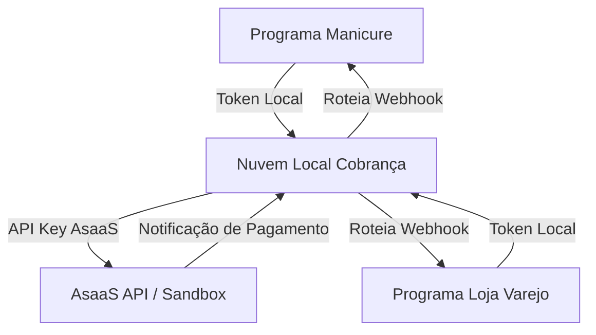

# Nuvem Local Cobrança

Documento de concepção para um serviço centralizado de integração com a API da **AsaaS** (Sandbox e Produção), atuando como um gateway multi-tenant para múltiplos programas clientes.

---

## 1. O Problema Atual

Atualmente, integrar faturamento/cobrança (Pix, Boleto, Cartão) exige configurar chaves de API, webhooks e lógica de persistência de forma individualizada em cada programa/sistema.
- **Dificuldade de manutenção:** Qualquer atualização na API da AsaaS exige manutenção em múltiplos repositórios.
- **Limitação de Webhooks:** A AsaaS permite configurar apenas um endpoint de webhook por conta. Em uma arquitetura com vários bancos de dados ou subdomínios independentes, fica difícil distribuir esses eventos.

---

## 2. A Solução Proposta (`nuvem-local-cobranca`)

Criar uma API centralizada que intermedeia a comunicação entre os programas clientes e a AsaaS.

### Funcionalidades do Gateway:
1. **Autenticação Centralizada:** OAuth `client_credentials` ou Tokens Fixos por sistema.
2. **Cofre de Credenciais:** As chaves da AsaaS ficam salvas de forma segura no banco central (ex: Supabase), protegendo os sistemas de invasões locais.
3. **Normalização de Contrato:** Um payload unificado e simplificado para criar cobranças, ocultando detalhes complexos da API de terceiros.
4. **Roteador de Webhooks (Multiplexador):** Recebe todos os eventos da AsaaS e redireciona para a URL configurada do programa que gerou a cobrança original.

---

## 3. Decisão de Infraestrutura: Vercel vs. VPS

Ainda não está definido se o serviço rodará em **VPS própria** (compartilhando a máquina do `nuvem-local-fiscal` e WhatsApp) ou de forma serverless na **Vercel**. Abaixo estão as vantagens de cada abordagem.

### Cenário A: Hospedar na Vercel (Serverless)

A Vercel é ideal para APIs leves e rotas de webhook que realizam tarefas de curta duração.

> [!TIP]
> **Vantagens da Vercel:**
> - **Zero Manutenção:** Sem necessidade de configurar Linux, Nginx, Let's Encrypt (HTTPS) ou monitoramento de processos.
> - **Custo Inicial Zero:** A maioria do tráfego rodará inteiramente dentro do plano gratuito.
> - **Deploy Simplificado:** Atualizações rápidas via `git push` com CI/CD nativo.
> - **Sem gargalos de timeout:** Como a API da AsaaS é REST pura e rápida (diferente do fluxo SOAP lento da SEFAZ), as funções serverless da Vercel atendem perfeitamente sem risco de estourar o limite de tempo de execução.

### Cenário B: Hospedar na VPS (Servidor Dedicado)

A VPS utiliza a mesma infraestrutura atual (`root@191.252.205.29`) rodando como um serviço independente em uma porta específica (ex: `3002`) atrás do Nginx.

> [!TIP]
> **Vantagens da VPS:**
> - **Processamento Assíncrono com Filas (BullMQ/Redis):** Se um sistema cliente estiver fora do ar quando o webhook de pagamento chegar, a VPS pode usar uma fila para tentar reenviar o webhook várias vezes de hora em hora.
> - **Conexão Local com Banco:** Se o banco de dados principal estivesse na mesma VPS, a latência seria extremamente baixa.
> - **Controle Total da Máquina:** Sem limites de execução e facilidade de depurar logs unificados com a infraestrutura que você já domina.

---

## 4. Estrutura de Dados e Roteamento de Webhooks

A lógica principal de distribuição dos webhooks baseia-se na tabela de **cobranças** (`billings`):

### Tabela `api_clients`
- `id` (UUID)
- `client_id` (identificador do sistema cliente)
- `client_secret_hash`
- `webhook_url` (Endpoint do sistema cliente para receber notificações de volta)
- `asaas_api_key` (Chave correspondente na AsaaS, permitindo usar contas diferentes se necessário)

### Tabela `billings`
- `id` (UUID interno gerado na VPS)
- `client_id` (FK para o sistema gerador)
- `external_id` (ID retornado pela AsaaS, ex: `pay_123456789`)
- `status` (PENDING, RECEIVED, OVERDUE, etc.)
- `payload_original` (JSON enviado pelo sistema cliente)

### O Fluxo do Webhook:
1. Um cliente paga um boleto/Pix.
2. A AsaaS dispara um webhook para a URL central: `https://seu-gateway.com/webhooks/asaas`.
3. O gateway lê o `paymentId` (ou `id` da cobrança no payload).
4. O gateway busca na tabela `billings` qual `client_id` e consequentemente qual `webhook_url` é o destino final.
5. O gateway faz um disparo HTTP POST para a `webhook_url` do cliente contendo o status atualizado do pagamento.

---

## 5. Próximos Passos recomendados

1. **Definição da Stack:** Iniciar um repositório Node.js com TypeScript.
2. **Definição do Hospedeiro:** Bater o martelo sobre a infraestrutura (Vercel atende muito bem e economiza tempo de configuração, mas a VPS oferece controle total sobre retries de webhook).
3. **Homologação:** Fazer o primeiro teste integrado simulando a geração de Pix e a recepção do webhook de confirmação.
